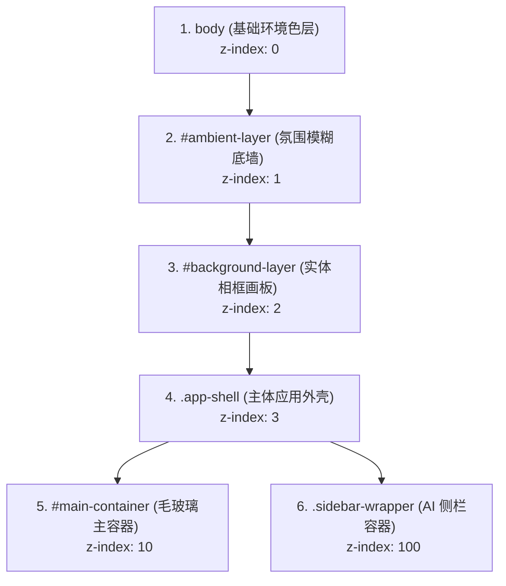

# 📌 新标签页布局元素定位与 DOM 结构说明文档

本手册旨在说明当前项目（特别是 `feature/gallery-frame-layout` 分支）的 **DOM 树层级结构**、**CSS 关键类名与 ID** 以及 **关键 CSS 变量**，以便在与 AI 交互时能够精确、快速地定位需要调整的视觉元素 and 代码位置。

---

## 🎨 1. 背景与画廊相框 3D 层级结构 (由低到高)

当前页面采用的是 **物理嵌入式艺术画板（Picture Frame Stage）** 布局，DOM 容器的上下叠放秩序（Z-Index）如下表所示：

### 🔍 关键背景元素定位

| 元素 ID / Class | 对应文件位置 | 作用与样式定位说明 |
| :--- | :--- | :--- |
| `body` | [styles.css](file:///Users/zanehao/kits/ai-project/bookmark-tree-extension/styles.css#L215) | 承载基础环境底色（`--body-bg`）。自定义壁纸判定为亮色时为 `#f4f6fa`，暗色时为 `#090b11` |
| `#ambient-layer` | [newtab.html](file:///Users/zanehao/kits/ai-project/bookmark-tree-extension/newtab.html#L12) [styles.css](file:///Users/zanehao/kits/ai-project/bookmark-tree-extension/styles.css#L228) | **自适应模糊霓虹底墙**。同步渲染自定义壁纸，并读取 `--ambient-blur` 和 `--ambient-brightness` 实现环境光晕。 |
| `#background-layer` | [newtab.html](file:///Users/zanehao/kits/ai-project/bookmark-tree-extension/newtab.html#L13) [styles.css](file:///Users/zanehao/kits/ai-project/bookmark-tree-extension/styles.css#L242) | **实体悬浮画廊相框**。缩回至居中的 `94vw * 91vh`。带有 `4px` 实体黑色描边（`border`）增强 3D 呈现、大圆角 `20px`（`border-radius`）与 3D 浮空大阴影（`box-shadow`）。 |
| `#background-layer::before` | [styles.css](file:///Users/zanehao/kits/ai-project/bookmark-tree-extension/styles.css#L254) | **解耦背景虚化层**。为 `#background-layer` 的子伪元素，单独读取 `--applied-blur` 模糊度和 `--applied-scale` 缩放，避免模糊扩散到 2px 实体黑色相框上。 |

---

## 🎛️ 2. 主体容器与排版排布

所有核心业务组件均被嵌套在以下容器内：

| 元素 ID / Class | 对应文件位置 | 样式与定位说明 |
| :--- | :--- | :--- |
| `.app-shell` | [styles.css](file:///Users/zanehao/kits/ai-project/bookmark-tree-extension/styles.css#L552) | **排版主容器外壳**。限制在 `94vw * 91vh`（与相框尺寸完全一致）内，使用 `overflow: hidden` 并设置 `border-radius: 20px` 进行画布内容裁剪。 |
| `#main-container` | [styles.css](file:///Users/zanehao/kits/ai-project/bookmark-tree-extension/styles.css#L560) | 主书签面板与古诗词面板。绑定了 `--container-blur` 档位对应的毛玻璃质感（`backdrop-filter: blur(...)`）。 |
| `.sidebar-wrapper` | [styles.css](file:///Users/zanehao/kits/ai-project/bookmark-tree-extension/styles.css#L1820) | **AI 侧边栏包装器**。采用 `position: fixed` 固定在右侧，滑出时会给 `.app-shell` 添加偏移，并在 3D 景深下让 `#background-layer` 产生立体推退过渡。 |
| `#settings-btn` | [newtab.html](file:///Users/zanehao/kits/ai-project/bookmark-tree-extension/newtab.html#L15) [styles.css](file:///Users/zanehao/kits/ai-project/bookmark-tree-extension/styles.css#L1817) | **设置齿轮按钮**。作为 `body` 直系子节点以摆脱主容器动画干扰，利用 `calc(4.5vw - 6px)` 与 `calc(4.5vh - 6px)` 精确将其圆心常态化与相框圆角的几何圆心重合，实现严丝合缝的“榫卯卡扣嵌入”咬合。 |

---

## 📝 3. 文字元素与阴影定位 (修复发虚后的新样式)

在亮色自定义壁纸模式下，移除了所有发虚的白色发光，更新后的阴影规范如下：

| 文本 Class / ID | 对应文件位置 | 字体粗细与阴影渲染说明 |
| :--- | :--- | :--- |
| `.poetry-title` `.poetry-line` | [styles.css](file:///Users/zanehao/kits/ai-project/bookmark-tree-extension/styles.css#L396) [styles.css](file:///Users/zanehao/kits/ai-project/bookmark-tree-extension/styles.css#L500) | **古诗词标题与正文**。 - 亮色背景：细小的暗色高对比边缘阴影 `text-shadow: 0 1px 2px rgba(0, 0, 0, 0.15)`。 - 暗色背景：清晰白字无发光。 |
| `.poetry-meta` | [styles.css](file:///Users/zanehao/kits/ai-project/bookmark-tree-extension/styles.css#L405) | **诗词作者/朝代署名**。阴影为极细暗投影 `text-shadow: 0 1px 1px rgba(0, 0, 0, 0.1)`。 |
| `.bookmark-label` | [styles.css](file:///Users/zanehao/kits/ai-project/bookmark-tree-extension/styles.css#L418) | **书签卡片标题字**。亮色背景下强制重置为 `text-shadow: none;`，保证毛玻璃背景上文字 100% 锐利。 |
| `.tree-folder-item` | [styles.css](file:///Users/zanehao/kits/ai-project/bookmark-tree-extension/styles.css#L426) | **左侧/扁平栏文件夹分类项**。亮色背景下清除白色发光，设为 `text-shadow: none;` 直出。 |
| `#search-input` | [styles.css](file:///Users/zanehao/kits/ai-project/bookmark-tree-extension/styles.css#L419) | **主搜索栏输入文字**。清除了任何白色毛边，使用纯净的 `text-shadow: none;`。 |

---

## ⚙️ 4. 设置控制面板对应的 DOM 与存储 Key

在右上角设置弹窗中，滑块与本地存储（Chrome Local Storage）的绑定逻辑如下：

| 设置项功能 | HTML 元素 ID | 本地存储 Key 名 | 对应的全局 JS 状态变量 | 传递的 CSS 属性 |
| :--- | :--- | :--- | :--- | :--- |
| **背景模糊度** | `#bg-blur` | `settings_bg_blur` | `CURRENT_BG_BLUR` | `--applied-blur` (作用于 `::before`) |
| **底图模糊度** | `#ambient-blur` | `settings_ambient_blur` | `CURRENT_AMBIENT_BLUR_LEVEL` | `--ambient-blur` (一档为 4px，作用于 `#ambient-layer`) |
| **毛玻璃及透明度** | `#container-blur` | `settings_container_blur` | `CURRENT_CONTAINER_BLUR` | `--glass-bg` / `backdrop-filter` (作用于卡片) |

---

## 🛠️ 5. JS 状态控制核心 logic 函数

若需要修改或扩展相关逻辑，直接搜索定位以下函数：

* **背景应用总入口**：
  `function applyBackground()`
  - 定义位置：[src/06-settings.js](file:///Users/zanehao/kits/ai-project/bookmark-tree-extension/src/06-settings.js#L801) 与 [script.js](file:///Users/zanehao/kits/ai-project/bookmark-tree-extension/script.js#L2894)。
  - 核心职责：读取 `CURRENT_BG_IMAGE` 与模糊档位状态，将图片 URL 和计算后的模糊像素以行内 `setProperty` 形式挂载到对应图层上，并对自适应提取的背景色调（`body.dataset.backgroundTone`）进行增删。
* **卡片毛玻璃程度更新**：
  `function applyContainerOpacity()`
  - 定义位置：[src/06-settings.js](file:///Users/zanehao/kits/ai-project/bookmark-tree-extension/src/06-settings.js#L827) 与 [script.js](file:///Users/zanehao/kits/ai-project/bookmark-tree-extension/script.js#L2920)。
